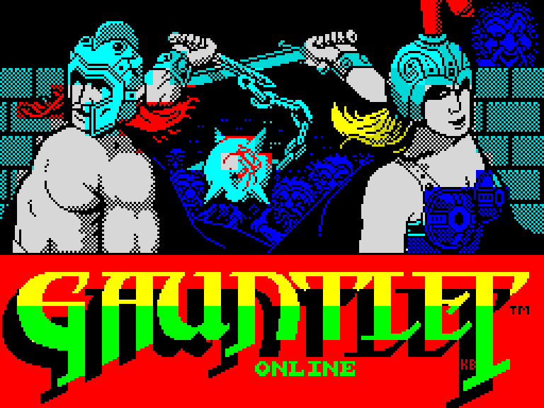

# Gauntlet Online



Online multiplayer fork of a faithful ZX Spectrum *Gauntlet* (1986, U.S.
Gold) JavaScript port. The plan: a single-player browser client, a
standalone C++ Windows server, and online play for up to 4 players — keeping
the original game's look, feel and rules while modernising how people reach
it.

Status: **online multiplayer for up to FOUR players** (2026-09-02).
The client is one local player; the simulation carries four player
blocks (the original's two, and two more cut to the same pattern and
proven against the two-block build pass for pass), the relay seats four
by default, and the in-game HUD is four quarters in the name tags' own
small font -- name, score, health, keys and potions, power icons -- one
per seat.  Whoever presses FIRE is
in, exactly the engine's own join-in model, and a dead player rejoins
the same way.

## Build & test

```
python tools/build.py     # client/template.html -> client/gauntlet.html
node tools/headless.js    # the client test suite (1472/1472)
```

Open `client/gauntlet.html` in a browser to play offline.

## Ready-made package

`python tools/package.py` builds `dist/Gauntlet-JS-Online-<tag>.zip` —
the server exe, the game page, the batch files and a README for hosts
and players — and each one is published as a GitHub release.

## Play online

The relay serves the game itself: run it, share the address, done.

```
server\build\gauntlet-relay.exe          # builds below; --port/--seats/--html (four seats by default)
```

Everyone opens `http://<host-ip>:33792/`, picks a character and a NAME
(worn over your head when players meet on screen, in your own colour —
left unset, your character's name), and STARTs with SERVER ONLINE —
START drops you straight into the dungeon, joining any game already
running.  When the whole party is dead you see everyone's scores, then
land back on the options screen, disconnected: START joins again.
Opening the
page from disk (or setting SERVER LOCAL) plays offline;
`?server=host:port` joins a relay from a page hosted elsewhere.

**Chat.**  In play, ENTER opens a line of speech and ENTER again sends
it: up to 32 characters (letters, digits, space and a little
punctuation), shown as a speech bubble over your character on every
screen that can see you, for five seconds.  ENTER on an empty line just
closes it.  You stand still while you type.  ENTER cannot be bound to
anything else.

**Full screen.**  Alt+Enter (or a double-click on the game, or the
corner button) shows the same 256x192 picture at the largest whole
multiple that fits your screen, letterboxed in the Spectrum border.
Alt+Enter again, or Escape, comes back.

The original's hurry-up -- doors opening, then every wall becoming an
exit, after minutes of nobody shooting or picking anything up -- is off
in this build: a table of four waiting on each other is not idling.

If a session stutters, paste `__GAUNTLET__.net.info()` from the
browser console (F12) on BOTH machines.  It names each machine's
exchange rate against the sim's own, the worst stall seen, the clean
link round trip (`rtt=min/median/worst`, from a once-a-second ping
the relay answers ahead of everything else) and how long each seat's
input waited at the relay for the others (`wait=`, per seat) — which
together separate "the wire is slow" from "one seat is slow".  `lead=`
and `tick=` say how far a hidden tab's game has run ahead of real time
and whether the speaker is keeping its clock: leaving the tab and
coming back should cost nothing but a skip in the sound.

For play from OUTSIDE the network, `--forward` asks the router to open
the port itself (NAT-PMP first, then UPnP), prints the public address
to share, renews the lease, and removes the mapping on Ctrl+C
(`--unforward` cleans one up by hand).  It also tells the truth when
forwarding cannot work: a DOUBLE-NAT setup (the router behind an ISP
modem — the outer box must forward too, or run in bridge mode) or
carrier-grade NAT (only the ISP or a tunnel can fix that).  The
Windows Firewall must allow the exe as well — it prompts on first run.

The C++ relay server (`server/relay.cpp`, protocol in
`shared/PROTOCOL.md`) builds inside the VS x64 environment:

```
vcvars64 && cmake -S server -B server\build -G Ninja
         && ninja -C server\build
python tools/protocheck.py                 # protocol constants in sync
node tools/relaytest.js                    # the relay's own gate (54 checks)
node tools/e2etest.js                      # four real clients through it (32 checks)
server\build\gauntlet-relay.exe            # run it (--port 33792 --seats 4)
```

## Provenance

Forked 2026-08-28 from the faithful port (its own repo/folder remains the
reference build and is unchanged by anything here). The first commit of this
repository is the pristine fork point — everything this fork changes is
visible as a diff against it.
